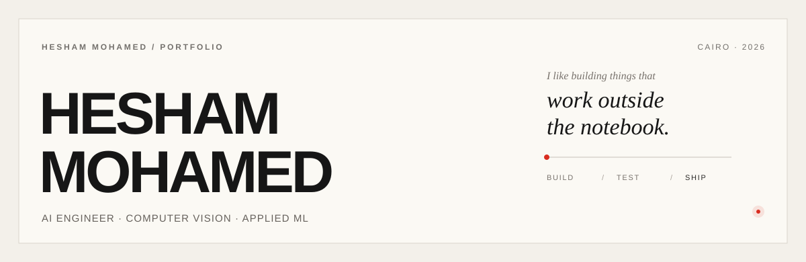

<picture>
  <source media="(prefers-color-scheme: dark)" srcset="assets/profile-header-dark.svg">
  <source media="(prefers-color-scheme: light)" srcset="assets/profile-header-light.svg">
  
</picture>

## 01 — Profile

I am an **AI Engineer** focused on computer vision and machine learning systems. I build applied AI that moves beyond model experiments into reliable pipelines, APIs, backend services, and deployable products.

My strongest work is in **real-time video analytics, multimodal vision, model integration, evaluation, and production-oriented ML engineering**. I am also developing deeper experience in RAG and tool-using agent systems.

Based in Cairo, Egypt. B.Sc. in Artificial Intelligence, 2026.

## 02 — Selected work

### VISION & DECISION (V&D)
**Industrial safety intelligence for existing CCTV infrastructure.**

Edge-first video analytics for PPE monitoring, falls, restricted zones, and forklift–worker proximity. The system combines detection, tracking, temporal safety logic, incident evidence, alerts, and HSE review workflows.

`Python` · `YOLO` · `OpenCV` · `ByteTrack` · `FastAPI` · `PostgreSQL` · `Redis` · `Docker`

[Repository →](https://github.com/s0ltan12/VisionSafe360)

### [AgriPheno Fusion](https://github.com/hishammohamed445/AgriPheno-Fusion)
**Multimodal crop phenotyping from RGB/NIR imagery and sensor data.**

A tested pipeline for image-quality checks, vegetation analysis, canopy cover, NDVI features, sensor fusion, structured outputs, CLI execution, and API delivery.

`Python` · `OpenCV` · `NumPy` · `FastAPI` · `Pydantic` · `pytest` · `Docker` · `GitHub Actions`

### [Donut Invoice Intelligence](https://github.com/hishammohamed445/Donut-Invoice-Intelligence)
**OCR-free document understanding for structured invoice extraction.**

Covers preprocessing, Donut fine-tuning, checkpointing, batch inference, FastAPI serving, and a lightweight client for application integration.

`PyTorch` · `PyTorch Lightning` · `Transformers` · `Donut` · `FastAPI` · `Docker`

## 03 — Technical focus

| Area | Working with |
| --- | --- |
| **Perception** | Object detection, tracking, video analytics, image processing, multimodal imagery |
| **Models** | PyTorch, scikit-learn, YOLO, Transformers, training, inference, evaluation |
| **Systems** | FastAPI, REST APIs, PostgreSQL, Redis, WebSockets, data validation |
| **Delivery** | Docker, Linux, Git/GitHub, GitHub Actions, pytest, reproducible workflows |
| **Developing** | RAG, vector retrieval, tool use, agent orchestration, evaluation |

I care about engineering that is **measurable, testable, maintainable, and understandable by the next engineer who works on it**.

## 04 — Contact

[LinkedIn](https://www.linkedin.com/in/hisham-mohamed0) · [Email](mailto:hishamelbaaly@gmail.com)

Open to **AI Engineer, Machine Learning Engineer, and Computer Vision Engineer** opportunities.
