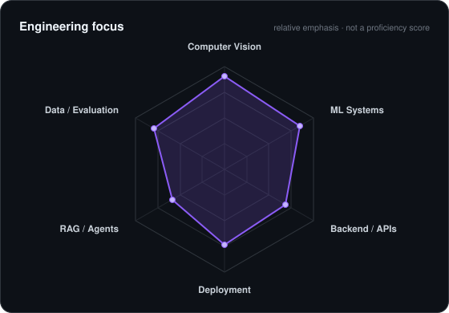
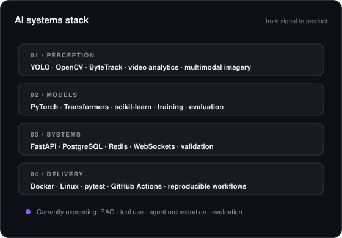

<picture>
  <source media="(prefers-color-scheme: dark)" srcset="assets/profile-header-dark.svg">
  <source media="(prefers-color-scheme: light)" srcset="assets/profile-header-light.svg">
  
</picture>

 

 

&nbsp;
&nbsp;

  

---

## This is me

Hi, I'm **Hisham** — an AI Engineer based in Cairo, Egypt.

I like working on the part of AI where a model stops being a notebook experiment and starts becoming a **real system**: video pipelines, inference services, APIs, data validation, event logic, deployment, and the engineering around the model.

- I work mainly across **Computer Vision, Machine Learning, and applied AI systems**.
- My strongest project work is in **real-time video analytics, multimodal vision, and document intelligence**.
- I built and contributed to **VISION & DECISION**, an industrial safety platform using existing CCTV for PPE, fall, restricted-zone, and forklift-worker risk monitoring.
- I care about **reproducible evaluation, clear failure boundaries, testing, and software another engineer can actually run**.
- I'm currently going deeper into **RAG, tool-using agents, orchestration, and evaluation for agentic systems**.
- B.Sc. in Artificial Intelligence, **2026**.

 

## my stack

---

## signals

<table>
<tr>
<td width="50%" align="center" valign="middle">

<picture>
  <source media="(prefers-color-scheme: dark)" srcset="assets/focus-map-dark.svg">
  <source media="(prefers-color-scheme: light)" srcset="assets/focus-map-light.svg">
  
</picture>

</td>
<td width="50%" align="center" valign="middle">

<picture>
  <source media="(prefers-color-scheme: dark)" srcset="assets/systems-stack-dark.svg">
  <source media="(prefers-color-scheme: light)" srcset="assets/systems-stack-light.svg">
  
</picture>

</td>
</tr>
</table>

---

## selected systems

### VISION & DECISION (V&D)
**Industrial safety intelligence for existing CCTV.** Real-time detection, tracking, temporal safety logic, incident evidence, alerts, and HSE workflows for PPE, falls, restricted zones, and forklift-worker proximity.

`YOLO` · `OpenCV` · `ByteTrack` · `FastAPI` · `PostgreSQL` · `Redis` · `Docker`

[View engineering project →](https://github.com/s0ltan12/VisionSafe360)

### [AgriPheno Fusion](https://github.com/hishammohamed445/AgriPheno-Fusion)
**Multimodal crop phenotyping from RGB/NIR imagery and sensor data.** Includes image-quality checks, vegetation analysis, NDVI features, sensor fusion, validation, tests, CLI execution, and API delivery.

`Python` · `OpenCV` · `NumPy` · `FastAPI` · `Pydantic` · `pytest` · `Docker`

### [Donut Invoice Intelligence](https://github.com/hishammohamed445/Donut-Invoice-Intelligence)
**OCR-free document understanding for structured invoice extraction.** Covers preprocessing, Donut fine-tuning, checkpointing, batch inference, FastAPI serving, and a lightweight client.

`PyTorch` · `Transformers` · `Donut` · `FastAPI` · `Docker`

---

## numbers

<picture>
  <source media="(prefers-color-scheme: dark)" srcset="https://github-profile-summary-cards.vercel.app/api/cards/stats?username=hishammohamed445&theme=github_dark">
  <source media="(prefers-color-scheme: light)" srcset="https://github-profile-summary-cards.vercel.app/api/cards/stats?username=hishammohamed445&theme=github">
  
</picture>
&nbsp;
<picture>
  <source media="(prefers-color-scheme: dark)" srcset="https://github-profile-summary-cards.vercel.app/api/cards/repos-per-language?username=hishammohamed445&theme=github_dark">
  <source media="(prefers-color-scheme: light)" srcset="https://github-profile-summary-cards.vercel.app/api/cards/repos-per-language?username=hishammohamed445&theme=github">
  
</picture>

---

**AI Engineer · Computer Vision · Machine Learning Systems**

Cairo, Egypt · Open to AI / ML / Computer Vision opportunities

