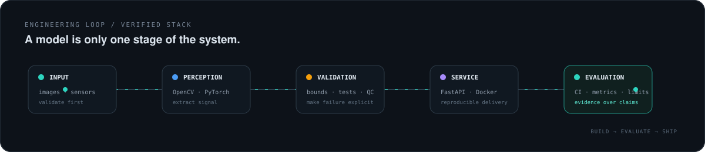

<picture>
  <source media="(prefers-color-scheme: dark)" srcset="assets/profile-header-dark.svg">
  <source media="(prefers-color-scheme: light)" srcset="assets/profile-header-light.svg">
  
</picture>

 

<a href="https://www.linkedin.com/in/hisham-mohamed0">LinkedIn</a>
&nbsp;·&nbsp;
<a href="mailto:hishamelbaaly@gmail.com">Email</a>
&nbsp;·&nbsp;
<a href="https://github.com/hishammohamed445">GitHub</a>

---

## 01 / POSITION

I build AI systems where the model is only one part of the job: **input validation, perception, inference, evaluation, APIs, testing, and reproducible delivery**.

My strongest public work currently sits across **computer vision, multimodal data, document intelligence, and ML-backed services**. I care about making technical limits visible — if a benchmark is not reproducible, I would rather leave the number out than turn it into marketing.

<picture>
  <source media="(prefers-color-scheme: dark)" srcset="assets/engineering-loop-dark.svg">
  <source media="(prefers-color-scheme: light)" srcset="assets/engineering-loop-light.svg">
  
</picture>

---

## 02 / SELECTED ENGINEERING

### [AgriPheno Fusion](https://github.com/hishammohamed445/AgriPheno-Fusion)

**RGB/NIR crop phenotyping with sensor fusion — designed as a tested engineering MVP, not a notebook demo.**

`Python` `OpenCV` `NumPy` `FastAPI` `Pydantic` `pytest` `Docker` `GitHub Actions`

- Validates image alignment and sensor bounds before feature extraction.
- Produces image-quality indicators, vegetation traits, NDVI statistics, and derived sensor features.
- Includes synthetic fixtures so the software path can be exercised without shipping a large or ambiguously licensed dataset.
- Documents what is heuristic, what is validated, and what still belongs in the production roadmap.

[Repository →](https://github.com/hishammohamed445/AgriPheno-Fusion) · [CI →](https://github.com/hishammohamed445/AgriPheno-Fusion/actions/workflows/ci.yml)

 

### [Donut Invoice Intelligence](https://github.com/hishammohamed445/Donut-Invoice-Intelligence)

**OCR-free document understanding for structured invoice extraction, from preprocessing and fine-tuning to inference and API serving.**

`PyTorch` `Transformers` `Donut` `FastAPI` `Docker` `Python`

- Covers preprocessing, model configuration, training, checkpointing, batch inference, and service delivery.
- Keeps large model weights and third-party datasets out of the repository deliberately.
- Runs dependency-light validation in CI without requiring multi-gigabyte model assets.
- Publishes **no accuracy/F1 claim** until a reproducible held-out evaluation report exists.

[Repository →](https://github.com/hishammohamed445/Donut-Invoice-Intelligence) · [CI →](https://github.com/hishammohamed445/Donut-Invoice-Intelligence/actions/workflows/ci.yml)

---

## 03 / CURRENT LAB

### [Mini Agent](https://github.com/hishammohamed445/mini-agent) `EARLY-STAGE`

A deliberately small FastAPI foundation for learning and building toward a RAG / tool-using agent service. The repository is currently infrastructure-first; retrieval, tool use, memory, and evaluation are roadmap items rather than finished claims.

**Exploring:** `RAG` · `tool calling` · `agent loops` · `retrieval evaluation` · `orchestration`

---

## 04 / OPERATING RANGE

<table>
<tr>
<td width="33%" valign="top">

**PERCEPTION & ML**

`Python`  
`PyTorch`  
`OpenCV`  
`Transformers`  
`NumPy`

</td>
<td width="33%" valign="top">

**SERVICES**

`FastAPI`  
`Pydantic`  
`REST APIs`  
structured inference  
batch pipelines

</td>
<td width="33%" valign="top">

**DELIVERY & QUALITY**

`Docker`  
`GitHub Actions`  
`pytest / unittest`  
input validation  
reproducible demos

</td>
</tr>
</table>

---

## 05 / ENGINEERING DEFAULTS

- **Validate before inference.** Bad input should fail loudly instead of quietly corrupting downstream results.
- **Separate evidence from aspiration.** Experimental heuristics, missing benchmarks, and production gaps should be labelled as such.
- **Make projects runnable.** A useful repository needs setup, interfaces, tests, and a path another engineer can follow.
- **Treat deployment as part of ML.** APIs, containers, configuration, CI, and failure boundaries are engineering work — not polish added at the end.

---

## 06 / NEXT

I am focused on growing deeper in **production AI engineering**, especially computer vision systems, multimodal ML, RAG, and agentic workflows with real evaluation around them.

Open to conversations around **AI Engineer, ML Engineer, and Computer Vision Engineer** work.

 

`BUILD → EVALUATE → SHIP`

Cairo, Egypt · <a href="mailto:hishamelbaaly@gmail.com">hishamelbaaly@gmail.com</a>

