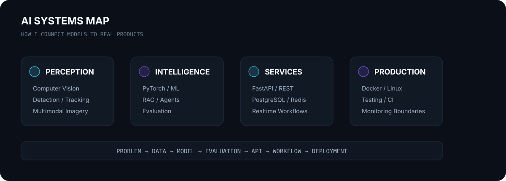

<div align="center">

<picture>
  <source media="(prefers-color-scheme: dark)" srcset="assets/hero-dark.svg">
  <source media="(prefers-color-scheme: light)" srcset="assets/hero-light.svg">
  
</picture>

<br>

<a href="https://github.com/hishammohamed445">
  
</a>

<br><br>

<a href="https://www.linkedin.com/in/hisham-mohamed0"></a>
&nbsp;
<a href="mailto:hishamelbaaly@gmail.com"></a>
&nbsp;

&nbsp;


<br><br>


</div>

---

## `01 / ABOUT`

I'm **Hisham Mohamed**, an AI Engineer based in Cairo, Egypt. I build AI systems that go beyond notebooks: **computer-vision pipelines, multimodal ML, real-time inference, document intelligence, RAG/agent workflows, APIs, data services, testing, and deployment-oriented engineering**.

My strongest work sits at the intersection of **models + software systems** — taking an idea from data and inference logic to something another engineer can run, test, integrate, and improve.

```text
I don't want the model to be the whole product.
I want the model to become a reliable part of the product.
```

- 🎓 B.Sc. in Artificial Intelligence — 2026
- 🧠 Core focus: AI Engineering, Computer Vision, Machine Learning Systems
- ⚡ Building toward: production-grade RAG, Agentic AI, and multimodal applications
- 🏭 Founder/Builder mindset: turning industrial AI ideas into field-ready systems
- 🎯 Open to: AI Engineer, ML Engineer, Computer Vision Engineer opportunities

---

<div align="center">

## `02 / HOW I BUILD`

<picture>
  <source media="(prefers-color-scheme: dark)" srcset="assets/systems-map-dark.svg">
  <source media="(prefers-color-scheme: light)" srcset="assets/systems-map-light.svg">
  
</picture>

</div>

---

<div align="center">

## `03 / SELECTED SYSTEMS`

</div>

<table>
<tr>
<td width="50%" valign="top">

### 🛡️ VISION & DECISION — Industrial Safety AI

**Edge-AI safety intelligence for existing CCTV.**

Real-time detection, tracking, safety rules, event aggregation, evidence, alerts, and HSE incident workflows for industrial environments.

**Focus:** PPE · restricted zones · falls · forklift-worker proximity · realtime video analytics

`YOLO` `OpenCV` `ByteTrack` `FastAPI` `PostgreSQL` `Redis` `Docker`

<a href="https://github.com/s0ltan12/VisionSafe360"><b>View engineering project →</b></a>

</td>
<td width="50%" valign="top">

### 🌱 AgriPheno Fusion

**Multimodal crop phenotyping from RGB/NIR + sensors.**

A tested MVP for image quality, vegetation segmentation, canopy cover, NDVI distributions, VPD, sensor fusion, CLI execution, and API delivery.

**Engineering:** deterministic pipeline · validation · automated tests · CI · Docker

`Python` `OpenCV` `NumPy` `FastAPI` `Pydantic` `pytest`

<a href="https://github.com/hishammohamed445/AgriPheno-Fusion"><b>Explore repository →</b></a>

</td>
</tr>
<tr>
<td width="50%" valign="top">

### 🧾 Donut Invoice Intelligence

**OCR-free document understanding.**

An image-to-sequence pipeline for structured invoice/receipt extraction, including preprocessing, Donut fine-tuning, checkpoints, batch inference, FastAPI, and a lightweight browser client.

**Focus:** document AI · vision transformers · structured extraction · serving

`PyTorch` `Lightning` `Transformers` `Donut` `FastAPI` `Docker`

<a href="https://github.com/hishammohamed445/Donut-Invoice-Intelligence"><b>Explore repository →</b></a>

</td>
<td width="50%" valign="top">

### 🤖 Mini Agent — In Progress

**A small foundation for learning agentic system architecture.**

Starting from a clean FastAPI service and growing toward retrieval, tool use, state, orchestration, evaluation, and safer agent behavior.

**Direction:** RAG · tools · memory/state · agent loops · evaluation

`Python` `FastAPI` `Uvicorn` `RAG` `AI Agents`

<a href="https://github.com/hishammohamed445/mini-agent"><b>Follow the build →</b></a>

</td>
</tr>
</table>

---

<div align="center">

## `04 / TOOLBOX`

### AI / ML / Vision


### Systems / Backend / Delivery


### Working areas


</div>

---

## `05 / ENGINEERING PRINCIPLES`

<table>
<tr>
<td width="33%" valign="top">

### Measure honestly
No performance claim without a reproducible evaluation path. Limitations belong in the repository, not hidden from it.

</td>
<td width="33%" valign="top">

### Build the system
A good model still needs validation, APIs, state, failure handling, tests, observability, and a clear operating boundary.

</td>
<td width="33%" valign="top">

### Make it runnable
A repository should tell another engineer what exists, what does not, how to run it, and how to verify it.

</td>
</tr>
</table>

---

<div align="center">

## `06 / SIGNALS`


<br>


</div>

---

## `07 / CURRENT VECTOR`

```text
real-time computer vision  ───────────────► production patterns
multimodal ML             ───────────────► stronger evaluation
RAG                       ───────────────► retrieval + grounding
agentic AI                ───────────────► tools + state + orchestration
VISION & DECISION         ───────────────► field-ready industrial AI
```

---

<div align="center">

### Let's build AI that survives contact with the real world.

<a href="https://www.linkedin.com/in/hisham-mohamed0"></a>
&nbsp;
<a href="mailto:hishamelbaaly@gmail.com"></a>

<br><br>

<sub><code>BUILD / TEST / EVALUATE / DEPLOY / IMPROVE</code></sub>

</div>
