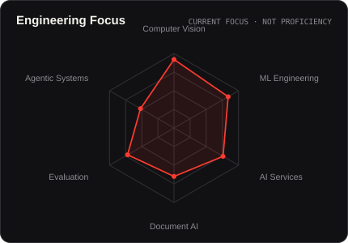
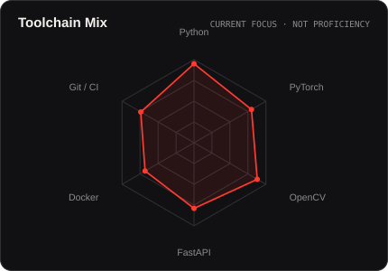
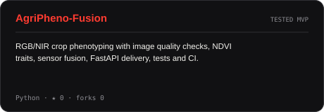
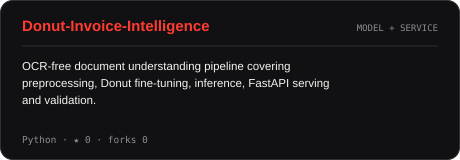
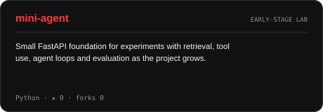
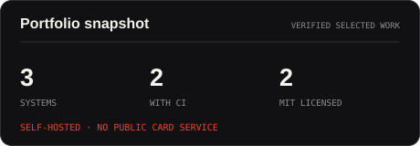
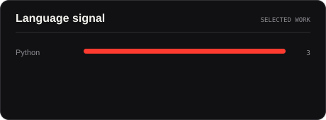

<picture>
  <source media="(prefers-color-scheme: dark)" srcset="assets/hero-dark.svg">
  <source media="(prefers-color-scheme: light)" srcset="assets/hero-light.svg">
  
</picture>

 

 

&nbsp;&nbsp;
&nbsp;&nbsp;

---

## this is me :)

Hi, I'm **Hesham**, an AI engineer from Cairo.

I like the part of AI that starts after the first demo works — turning experiments into software that can be tested, explained, and used by someone else.

- 👁️ **Computer vision is home base.** I enjoy perception problems, image pipelines, video systems, and the engineering around models.
- 🧱 I care about the whole path: **input → model → validation → API → product**, not only training a model in a notebook.
- 🧪 I would rather document a limitation than hide it behind a nice metric.
- 🤖 Right now I'm going deeper into **RAG, tool-using agents, orchestration, and evaluation**.
- 🌱 I am still early in my career, so this profile is also a record of what I am learning and shipping in public.
- 💬 Talk to me about **Computer Vision, production ML, or why a model demo is not the same thing as a system**.

 

## the tools I keep reaching for

---

## signals

<table><tr>
<td width="50%" align="center" valign="middle">
<picture><source media="(prefers-color-scheme: dark)" srcset="assets/focus-dark.svg"><source media="(prefers-color-scheme: light)" srcset="assets/focus-light.svg"></picture>
</td>
<td width="50%" align="center" valign="middle">
<picture><source media="(prefers-color-scheme: dark)" srcset="assets/toolchain-dark.svg"><source media="(prefers-color-scheme: light)" srcset="assets/toolchain-light.svg"></picture>
</td>
</tr></table>

These charts describe what my current public work is concentrated around — not a claim that skills can be measured as a percentage.

---

## selected builds

<table><tr>
<td width="50%" valign="top"><a href="https://github.com/hishammohamed445/AgriPheno-Fusion"><picture><source media="(prefers-color-scheme: dark)" srcset="assets/card-agripheno-dark.svg"><source media="(prefers-color-scheme: light)" srcset="assets/card-agripheno-light.svg"></picture></a></td>
<td width="50%" valign="top"><a href="https://github.com/hishammohamed445/Donut-Invoice-Intelligence"><picture><source media="(prefers-color-scheme: dark)" srcset="assets/card-donut-dark.svg"><source media="(prefers-color-scheme: light)" srcset="assets/card-donut-light.svg"></picture></a></td>
</tr></table>

<a href="https://github.com/hishammohamed445/mini-agent"><picture><source media="(prefers-color-scheme: dark)" srcset="assets/card-mini-agent-dark.svg"><source media="(prefers-color-scheme: light)" srcset="assets/card-mini-agent-light.svg"></picture></a>

---

## a small portfolio snapshot

<table><tr>
<td width="50%" align="center"><picture><source media="(prefers-color-scheme: dark)" srcset="assets/card-summary-dark.svg"><source media="(prefers-color-scheme: light)" srcset="assets/card-summary-light.svg"></picture></td>
<td width="50%" align="center"><picture><source media="(prefers-color-scheme: dark)" srcset="assets/card-languages-dark.svg"><source media="(prefers-color-scheme: light)" srcset="assets/card-languages-light.svg"></picture></td>
</tr></table>

The cards are generated inside this repository from GitHub data. No public stats-card service sits between the profile and the assets.

---

` build carefully · measure honestly · keep shipping `

