<picture>
  <source media="(prefers-color-scheme: dark)" srcset="assets/profile-header-dark.svg">
  <source media="(prefers-color-scheme: light)" srcset="assets/profile-header-light.svg">
  
</picture>

 

<a href="https://www.linkedin.com/in/hisham-mohamed0">LinkedIn</a>
&nbsp;&nbsp;·&nbsp;&nbsp;
<a href="mailto:hishamelbaaly@gmail.com">Email</a>
&nbsp;&nbsp;·&nbsp;&nbsp;
<a href="https://github.com/hishammohamed445?tab=repositories">Repositories</a>

 

## A little about me

I'm **Hesham**, an AI engineer from Cairo.

Most of my work lives somewhere between a model and the thing people actually use. I enjoy the messy middle: making inputs reliable, wiring models into services, testing what can go wrong, and turning experiments into software another person can run.

Computer vision is where I feel most at home. Lately, I've also been spending more time with multimodal systems, document intelligence, RAG, and small agent workflows.

I don't try to make every project look finished. If something is still an experiment, I prefer to say that plainly.

 

## Selected work

<table>
<tr>
<td width="50%" valign="top">

### AgriPheno Fusion

A small but complete RGB/NIR phenotyping system that combines image analysis with environmental sensor data.

The interesting part for me wasn't just calculating NDVI — it was making the whole path predictable: validation, quality checks, traits, API output, tests, Docker, and CI.

**Python · OpenCV · FastAPI · Pydantic · Docker**

[open project →](https://github.com/hishammohamed445/AgriPheno-Fusion)

</td>
<td width="50%" valign="top">

### Donut Invoice Intelligence

An OCR-free document understanding project built around Donut for extracting structured fields from invoices and receipts.

It covers preprocessing, training, inference, and serving. I deliberately leave accuracy claims out until the project has a reproducible held-out evaluation report.

**PyTorch · Transformers · Donut · FastAPI**

[open project →](https://github.com/hishammohamed445/Donut-Invoice-Intelligence)

</td>
</tr>
</table>

 

### Mini Agent — work in progress

A lightweight FastAPI base that I'm using to learn and build toward a small RAG / tool-using agent service. Right now it's intentionally early-stage; retrieval, tools, memory, and evaluation are things I'm adding rather than things I'm pretending are already done.

[follow the build →](https://github.com/hishammohamed445/mini-agent)

 

## Things I reach for

`Python` · `PyTorch` · `OpenCV` · `Transformers` · `FastAPI` · `PostgreSQL` · `Redis` · `Docker` · `Git` · `Linux`

Not a badge wall — just the tools that show up repeatedly in the work I care about.

 

## These days

I'm getting deeper into **production AI**, with most of my attention on computer vision, multimodal ML, RAG, agentic workflows, and the evaluation that makes those systems worth trusting.

I'm especially interested in work where the model is only part of the problem.

 

build carefully · test what matters · ship something useful

  

Cairo, Egypt &nbsp;·&nbsp; <a href="mailto:hishamelbaaly@gmail.com">say hello</a>

